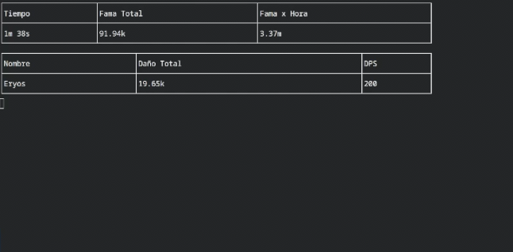

## Ancient DPS Meter
*Ever wanted to know how much DPS are your party members dealing? How efficient your grinding method is?*

Don't worry anymore! As here, I present you... ***The ancient DPS meter!***

A rushed, **linux** compatible, light-weight, terminal based DPS Meter to save your day, fellow Linux player. (How I wish Triky313/AlbionOnline-StatisticsAnalysis worked on linux...)

Anyway! It can be simple but functional: 
- 
- Has a total fame counter
- Fame/hour (wow! time to rush world boss!)
- Registers party join/leaver
- Total Damage per player (HPS not implement)
- Total DPS, automatically sorted (it can be nightmarish code but atleast I sorted!)

Here are a few screenshots:

## Installation
1. Just clone this repository
2. Give **start.sh** exec permissions
3. Execute **start.sh**
4. Profit.

You can also manually install it by running `npm install` and then `node .` inside the project folder
**Root** is needed as to be able to capture Albion Online packets 

**NodeJS v24 is needed**